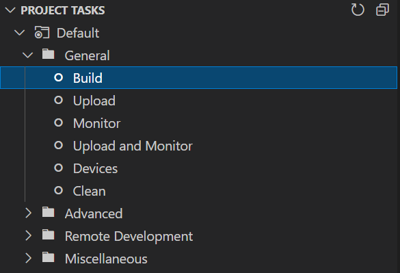

# Blooming Flower Night Light using ESP8226

Inspiration for the adjusted code is the original [3D Print This Blooming Flower Night Light](https://makezine.com/projects/3d-print-this-blooming-flower-night-light/) project. The original arduino based code can be found [here](https://github.com/ossum/bloomingossumlamp).

This version is heavily adjusted to work with a ESP8266 - in my case a Wemos D1 Mini. In addition it uses a [WiFi manager](https://github.com/tzapu/WiFiManager) and [MQTT client](https://github.com/knolleary/pubsubclient/) to be controllable by the outside world.

## Requirements

* PlatformIO installation (I use it as [plugin](https://marketplace.visualstudio.com/items?itemName=platformio.platformio-ide) inside [VSCode](https://code.visualstudio.com/))
* ESP8266 micro controller e.g. Wemos D1 mini

## Build

Execute `pio run` or `platformio.exe run` on your machine or execute the "build" task inside the PlatformIO extension.

The process will generate firmware files for each configured micro controller in the [platformio.ini](./platformio.ini) file. Files are located in `.pio/build/<TARGET>/firmware.elf`
